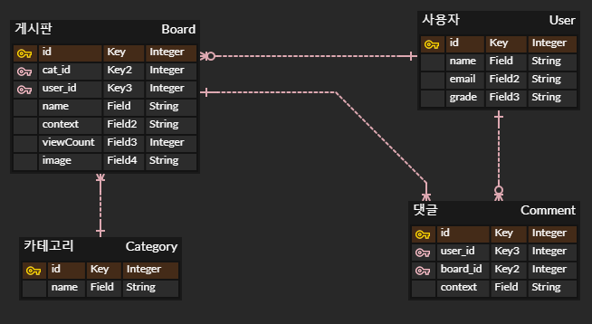

# Fisa-Step04-MiniProject

### 프로젝트 목적
- java MVC패턴 학습

### DataStructure

### 구현 메소드
- Create
    - createBoard(int userId, int catId, String name, String, context, String image)
    - createUser(String name, String email, String grade)
    - createComment(int boardId, int userId, String context)
    - createCategory(String name)
- Read
    - getUser(Integer id)
    - getBoardAll()
    - getBoardInPage(Integer page)
    - getBoardByTitle(String title)
    - getBoardByTitleInPage(String title , Integer page)
    - getCommentAll()
    - getCommmentListByUserId(Integer userId)
    - getCommmentListByUserIdInPage(Integer userId, Integer page)
    - getCommentListByBoardId(Integer boardId)
    - getCommentListByBoardIdInPage(Integer boardId , Integer page)
    - getCategoryAll()
    - getCategoryById(int id)
- Update
    - updateBoardName(int boardId String boardName)
    - updateBoardContext(int boardId, String context)
    - updateImage(int boardId, String image)
    - updateCategory(int catId, String catName)
    - updateUserName(int userId, String userName)
    - updateUserEmail(int userId, String userEmail)
    - updateUserGrade(int userId, GradeType grade)
    - updateCommentContext(int commentId, String Comment)
    - addViewCount(int boardId)
    -
- Delete
    - deleteBoard(int id);
    - deleteCategory(int id);
    - deleteComment(int id);
    - deleteUser(int id);

- Fail
    - failViewMessage(String message)
- sucess
    - successMessage(String message)